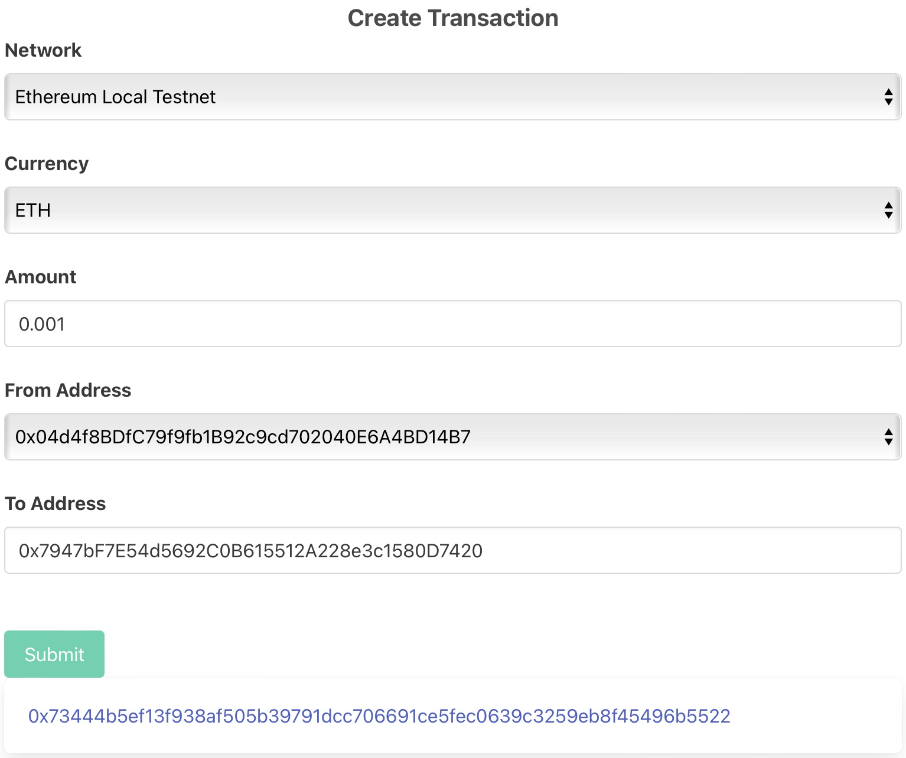

# Overview
The project demostrates how to create a transaction on blockchains.

Supported blockchains include:
- Ethereum local testnet (Ganache)

Notes:
The same code can be used for Ethereum, Polygon, and other EVM compatible networks. Networks other than local testnet are not included because they need a third party node provider, such as Infura, for retrieving nonce, gas price, etc.

# How to Use
- Install dependencies:
```go get -d ./...```
- Start the testnet Docker container:
```make infra-up```
- Launch the demo app:
```go run internal/blockchain/demo/main.go```
- Then go to the URL:
http://localhost:9111


